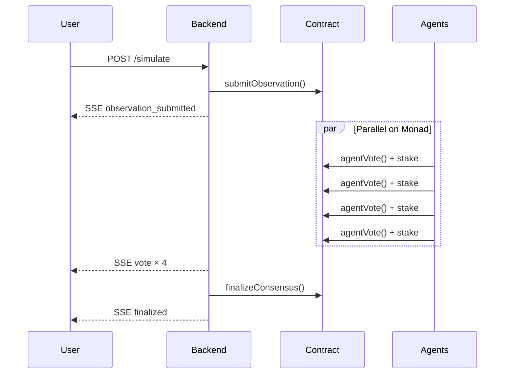

# Proof of Reality — Architecture

## System Overview

```
┌─────────────────────────────────────────────────────────────────────────┐
│                         Web Client (Vercel)                             │
│              Dashboard · Map · Agents · Treasury                        │
└───────────────────────────────┬─────────────────────────────────────────┘
                                │
                    HTTP POST /simulate · GET /state · SSE /events
                                │
┌───────────────────────────────▼─────────────────────────────────────────┐
│                      Backend (Railway / Node.js)                        │
│  ┌─────────────────┐  ┌──────────────────┐  ┌───────────────────────┐  │
│  │  Agent Swarm    │  │   Finalizer      │  │  SSE Event Broadcast  │  │
│  │  (4 agents)     │  │  (quorum check)  │  │  (activity feed)      │  │
│  └────────┬────────┘  └────────┬─────────┘  └───────────────────────┘  │
└───────────┼────────────────────┼────────────────────────────────────────┘
            │                    │
            │  agentVote()       │  finalizeConsensus()
            ▼                    ▼
┌─────────────────────────────────────────────────────────────────────────┐
│              ProofOfReality.sol — Monad Testnet (10143)                 │
│  0x85c1C9CB97438DDE2E680804a7A6Dbff68F2bB38                             │
└─────────────────────────────────────────────────────────────────────────┘
```

## Data Flow



## Frontend Structure

| View | Source | Data |
|------|--------|------|
| Dashboard | `views/Dashboard.tsx` | Live observations, metrics |
| Map | `views/MapView.tsx` (lazy) | On-chain geolocated claims |
| Agents | `views/AgentsView.tsx` | Wallet, reputation, accuracy |
| Treasury | `views/TreasuryView.tsx` | MON balances |

Design tokens: `frontend/src/theme/` (`colors.ts`, `tokens.ts`, `theme.ts`)

## Deployment

| Service | URL |
|---------|-----|
| Frontend | https://proof-of-reality-hazel.vercel.app |
| Backend | https://backend-production-3dd92.up.railway.app |
| Contract | `0x85c1C9CB97438DDE2E680804a7A6Dbff68F2bB38` |

## Why Monad

Each observation uses isolated contract storage. Independent agent votes on different observations execute in parallel — matching Monad's concurrent execution model.
