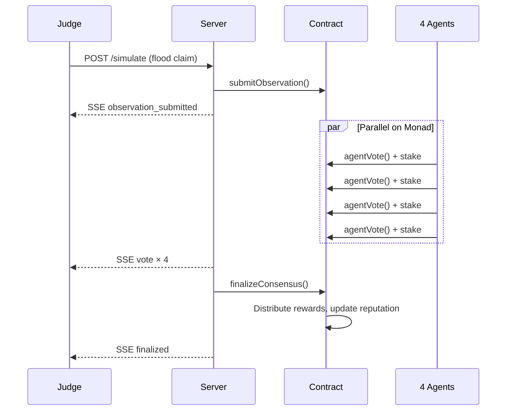

# Proof of Reality — Architecture

## System Overview

```
┌─────────────────────────────────────────────────────────────────────────┐
│                         JUDGE / OPERATOR                                │
│                    (Browser + Simulate Button)                          │
└───────────────────────────────┬─────────────────────────────────────────┘
                                │
                    HTTP POST /simulate · GET /state · SSE /events
                                │
┌───────────────────────────────▼─────────────────────────────────────────┐
│                      BACKEND SERVER (Node.js)                           │
│  ┌─────────────────┐  ┌──────────────────┐  ┌───────────────────────┐  │
│  │  Agent Swarm    │  │   Finalizer      │  │  SSE Event Broadcast  │  │
│  │  (4 agents)     │  │  (quorum check)  │  │  (live activity feed) │  │
│  └────────┬────────┘  └────────┬─────────┘  └───────────────────────┘  │
└───────────┼────────────────────┼────────────────────────────────────────┘
            │                    │
            │  agentVote()       │  finalizeConsensus()
            │  (4 parallel txns) │
            ▼                    ▼
┌─────────────────────────────────────────────────────────────────────────┐
│              ProofOfReality.sol — Monad Testnet (10143)                 │
│  0x85c1C9CB97438DDE2E680804a7A6Dbff68F2bB38                             │
│                                                                         │
│  submitObservation() → observations[id] (isolated storage slot)         │
│  agentVote()         → per-agent stake + vote record                    │
│  finalizeConsensus() → payout winners, slash losers, update reputation  │
└─────────────────────────────────────────────────────────────────────────┘
            │
            │  Claude AI via OpenRouter (per-agent reasoning)
            ▼
┌─────────────────────────────────────────────────────────────────────────┐
│  Agent-Flood 🌊  Agent-Grid ⚡  Agent-Crowd 👥  Agent-Skeptic 🔍         │
│  Independent wallets · Independent stakes · Autonomous decisions        │
└─────────────────────────────────────────────────────────────────────────┘
```

## Data Flow (One Observation)



## Why Monad Fits

| Property | PoR Requirement | Monad Advantage |
|----------|----------------|-----------------|
| Storage isolation | Each observation = separate slot | Parallel execution without conflicts |
| Concurrent agents | 4 votes per observation | Independent txns execute together |
| Scale path | 1000 agents × N observations | Throughput doesn't queue linearly |

## Components

| Layer | File | Role |
|-------|------|------|
| Contract | `contracts/ProofOfReality.sol` | On-chain truth, stakes, reputation |
| Agents | `agents/agentSwarm.mjs` | AI voting swarm |
| Finalizer | `agents/finalizer.mjs` | Auto-consensus when quorum met |
| API | `server/index.mjs` | State, simulate, SSE |
| Frontend | `frontend/src/` | Map, economy, demo, inspector |

## Network

- **Chain**: Monad Testnet (Chain ID 10143)
- **RPC**: `https://testnet-rpc.monad.xyz`
- **Contract**: `0x85c1C9CB97438DDE2E680804a7A6Dbff68F2bB38`
